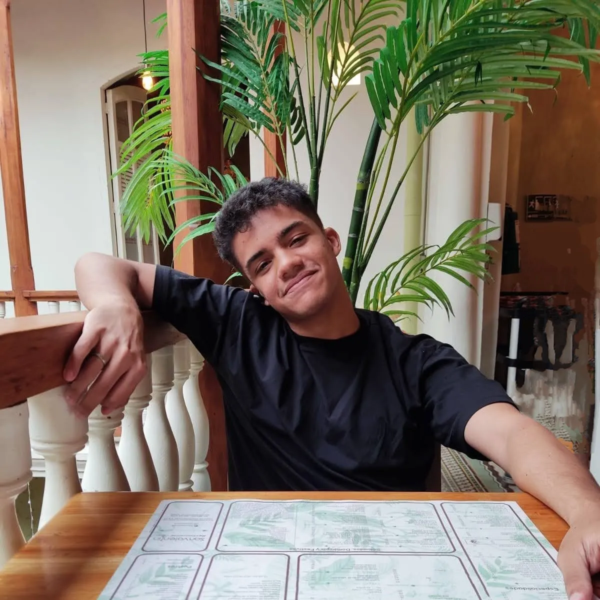

"Exploring technology, faith, and meaningful impact."

  

    
Hi, I'm Sebastian Arrieta, a Colombian software developer passionate about creating systems that make a meaningful difference in people's lives. I thrive on learning new technologies and fostering collaboration within development teams to deliver impactful solutions.

    
Outside of coding, I enjoy spending time reading my Bible and volunteering at my local church, where I find inspiration and purpose beyond work.

    
Currently, I'm focused on improving my writing skills through a blog where I share insights on programming and system design. I'm also excited about the journey of starting my own company.
    

  

  

    
  

## Projects

These are some projects that I'm proud of:

- [[CampusCal]]: Developed a comprehensive booking system for the University of Cartagena, streamlining the management of college spaces. Enhanced user experience by reducing booking times by 50% through an intuitive design and efficient workflows. Built using **Laravel**, **Vue.js**, and **TailwindCSS**.
- [[Horizon]]: Created a robust software solution for managing issues in horizontal property administration. Focused on scalability and user-friendly interfaces to simplify property management processes. Built with **React.js** and **Spring Boot**.
- [[Shoppingify]]: Designed and built a web application for managing shopping lists and providing advanced analytics to track purchasing habits. Developed with a strong focus on **Domain-Driven Design (DDD)** principles to ensure scalability and maintainability.
